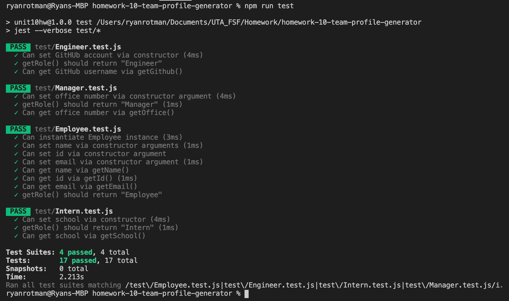
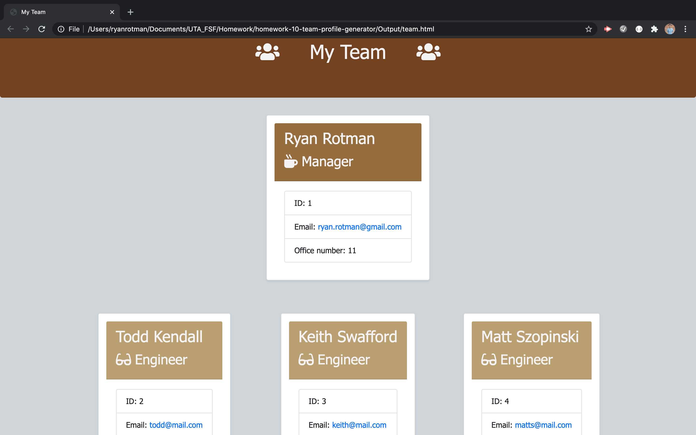
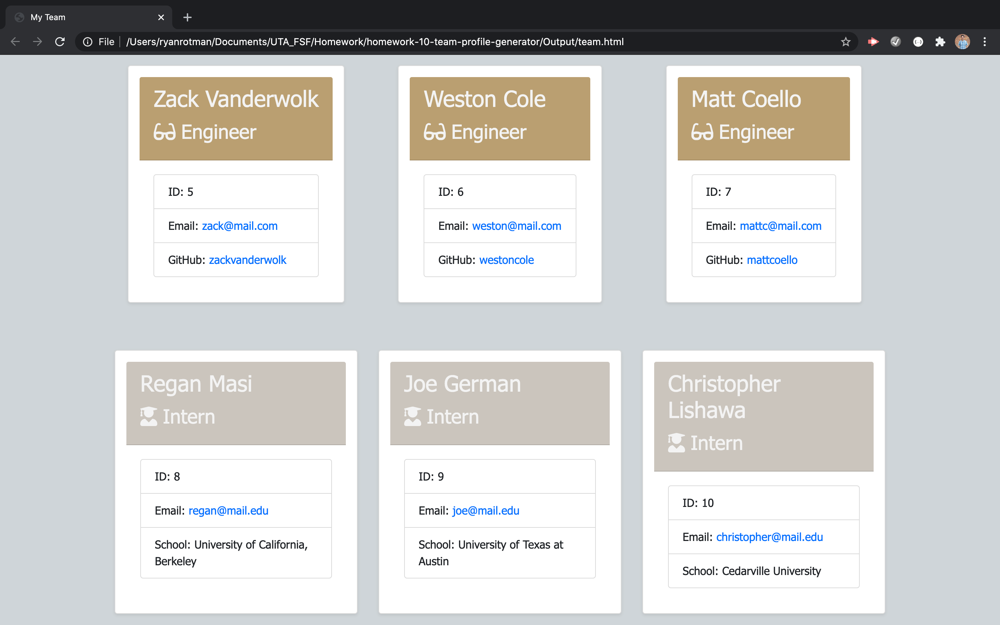

# Homework 10: Team Profile Generator

## Description
This repository holds the homework assignment for Week 10 of the [The Coding Boot Camp](https://techbootcamps.utexas.edu/coding/) through the University of Texas at Austin's Center for Professional Education.

The scope of this project is to create a command line application that dynamically creates an html page that lists the members of a team based on three classes; manager, engineer, and intern. This application uses Node and the Inquirer package to prompt the user with questions and to provide input based on each member of the team. This application also has specific questions based on the role of each team member. In the development of this application, unit tests were also implemented. 

## Notes
* This project implemented unit tests for each section and all sections needed to pass. Here is the output of my unit tests.
    

## Instructions
To use this project you will need to clone this repository and then open it in your text editor of choice. You will also need access to a CLI. This projected was created using VSCode and then run in the integrated terminal. Assuming that Node.js is already installed, you will need to run ```npm install``` and then you can run ```node app.js``` to launch the application and proceed through the prompts.

## Usage
[Here is a video walkthrough of the project.](https://drive.google.com/file/d/1w39yOM-MZdt1zuDuOsAq00sdObA8Fi7v/view)

## Page Screenshots



## Contributing
Any and all collaboration is welcome so if you have any suggestions or thoughts for new features, please send me an email at ryan.rotman@gmail.com.